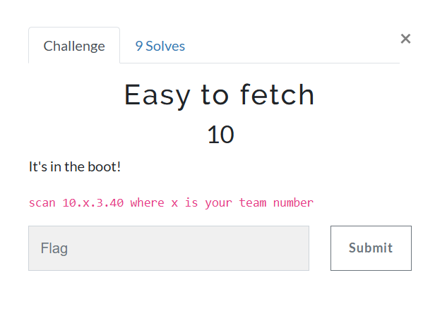
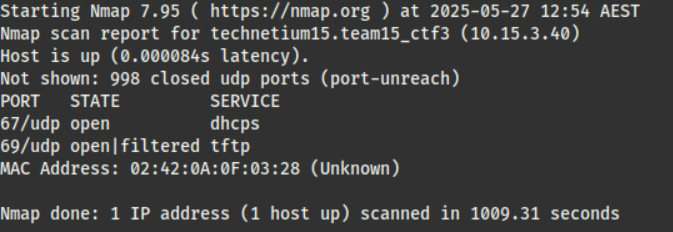
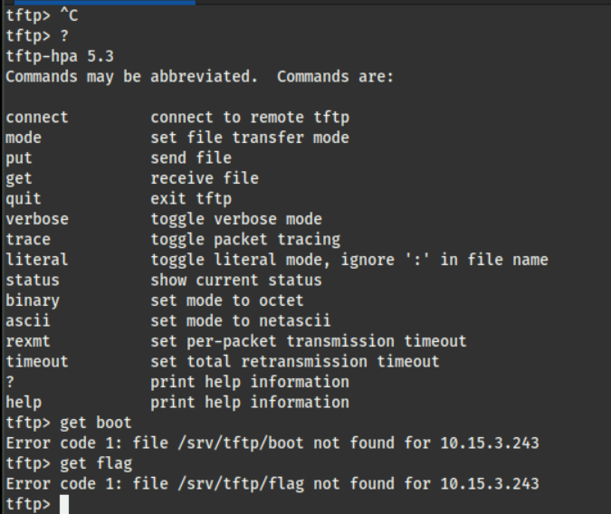
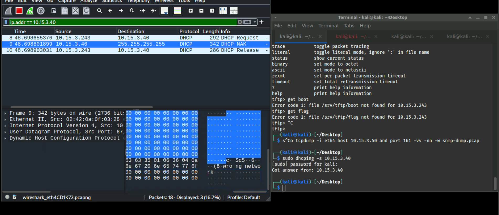
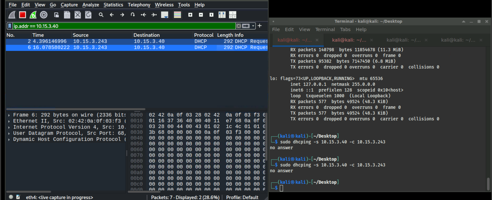
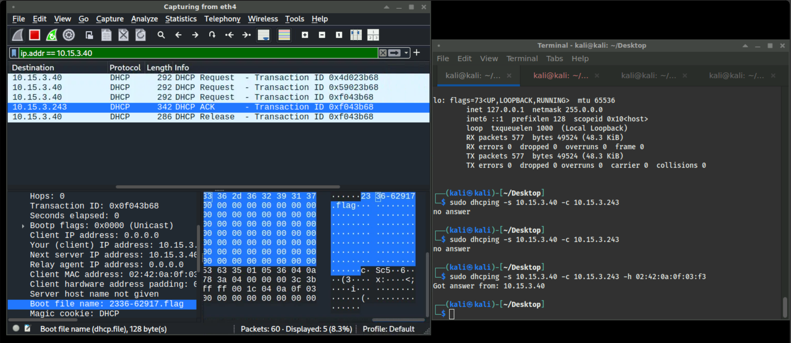
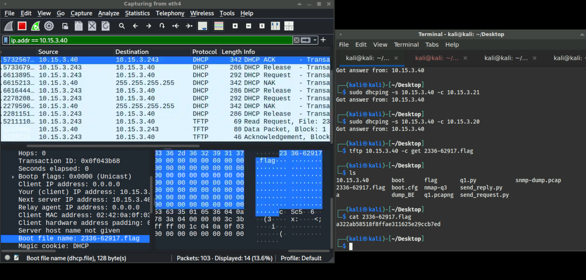

# Easy to Fetch



At first, I began by scanning the ports like what I had done in the other challenges. However, it revealed nothing, so I scanned the top 1000 UDP ports instead.

```bash
nmap -sU --top-ports 1000 <ip>
```



From the output, the open ports are 67 and 69 — for **DHCP** and **TFTP**, respectively.

First, I tried to connect to the TFTP protocol and play around with it. Unfortunately, from the help menu of TFTP, we don't have the `ls` command. So I just tried guessing the name of the flag file.
**Spoiler alert!!** That didn’t work ._.

This made me hypothesize that the file name of the flag might be given by another protocol.



Next, I tried to use the DHCP service on the server by using the `dhcping` command to interact with it.




From both outputs above, these are my first attempts at using `dhcping` randomly, which in fact did not work. In the first image, I specified only `-s`, which is the server IP. In the second image, I specified both the server IP and client IP with `-c`.
Actually, in the packet captures from both images, there is a section about the **boot file**, which reminded me of the hint in the challenge description. However, neither attempt revealed anything about the boot file, since I used the protocol incorrectly.

By looking at the `man` page of `dhcping`, I found that the correct usage requires specifying both the MAC address and the IP related to it. So the correct command should be:

```bash
dhcping -s <server_ip> -c <client_ip> -m <mac_address>
```



After adding the MAC address, the protocol successfully responded with the assigned IP **together with the boot file name**.
Now, I continued with my hypothesis — that the **boot file name** returned from the DHCP response is probably the name of the flag.

Then, I tried requesting this file from the TFTP server:



Luckily, this actually gave me the flag for the challenge.

---

# Note to self

## Funny Protocols

- **DHCP**: An IP configuration protocol that dynamically assigns IP addresses.

  *Fun fact*: DHCP replaced the old BOOTP protocol, meaning it also supports sending a boot file to diskless clients — the same boot file mentioned in the challenge description.

- **TFTP**: A simple file transfer protocol that uses UDP for file transfer.
