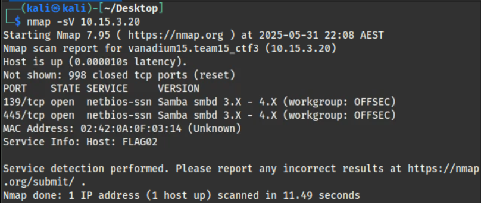
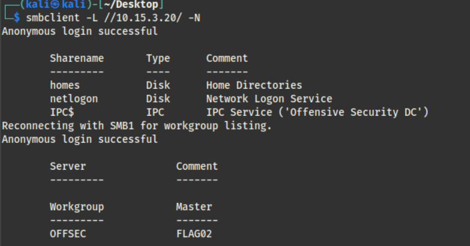
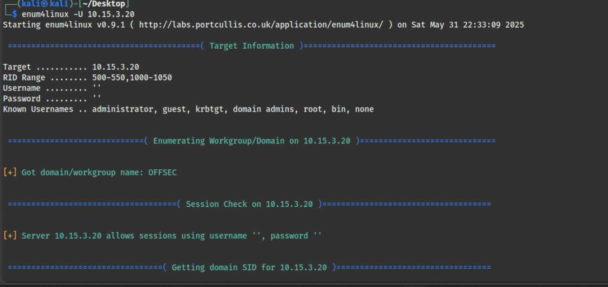
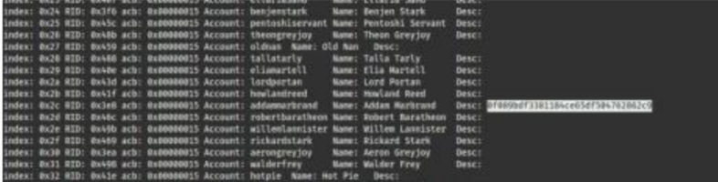

# Would you like to dance?

-----

The first thing I tried was to scan the ports to see which ones were open for interaction.

From the image above, the open ports are **139/tcp** and **445/tcp**, both associated with [NetBIOS-SSN](#note-about-the-protocols) services. Since the version is identified as Samba `smbd`, these ports seem to be used for sharing files with printers or other devices while establishing a session with NetBIOS.

After asking ChatGPT what I could do to interact with this protocol next, the following command was suggested: `smbclient -L //10.15.2.20/ -N`

`smbclient` is the command used to make a client connection to the server—similar to how `ssh` is used to connect with an SSH server. The `-L` and `-N` options are used to **list shared resources** and to **disable the password prompt**, respectively.

**Funny note**: `//ip/` is the UNC path style format used with the SMB protocol. This simply means: `//server/share`

After trying to manually browse using `ls` inside these shares for a while, I discovered that the `enum4linux` command could automatically enumerate the shares on this server.

Luckily, I found the flag in the **account information section**, specifically in the description of one user.

---

## Note to self

### Protocol Knowledge

- **NetBIOS (Network Basic Input/Output System)**
  An old protocol operating at the session layer, used for communication between computers in the same LAN. However, with the advent of TCP/IP, **NetBIOS over TCP/IP** allows connections beyond the local network. Note that `netbios-ssn` refers to the NetBIOS Session Service.

- **SMB (Server Message Block)**
  An application-layer protocol used for sharing files between devices on a network.

### Commands

- `smbclient` -  ftp-like client to access SMB/CIFS resources on
      servers
- `enum4linux` - tool for enumerating information from Windows and Samba systems.
