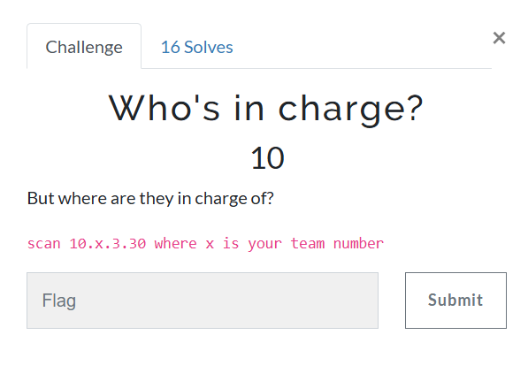
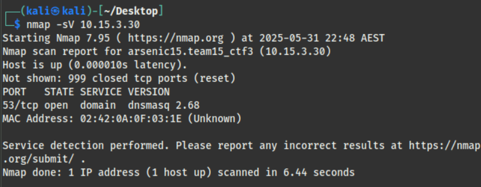
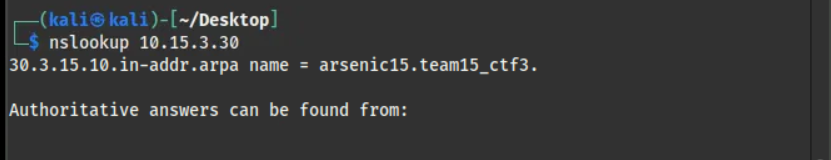
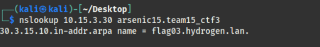
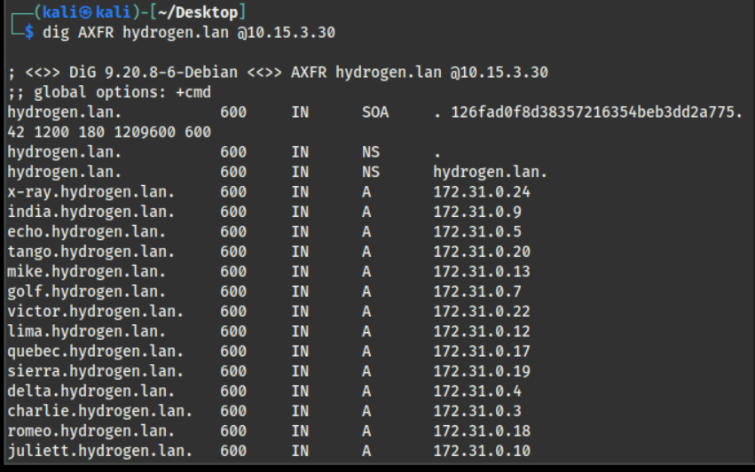

# Who is in charge?

---

I began with port scanning again.

From the output, the available service is DNS service, which we normally use to look up the IP address of domain names.

What I tried first is checking the domain name of the server from my DNS server.

While trying different stuff like looking up the IP or the domain name of other websites, I randomly tried looking up the domain name "arsernic15.team15_ctf3" of the challenge server on its DNS service.

This seems like the domain name is set to be different from the challenge server and local server. However, this doesn't reveal anything much important.

Then I tried to look up more about vulnerabilities related to DNS.

One thing I found is DNS spoofing, but when I tried looking at the network traffic from Wireshark, it seemed like no one is communicating with the challenge servers, so I guess that it probably may not be related to DNS spoofing.

Fortunately, by checking the zone transfer vulnerabilities with `dig` command, the flag is found.

## Note to Self

### Commands related to DNS
- `nslookup` — for basic DNS queries and domain resolution
- `dig` — powerful DNS querying tool, also supports zone transfer attempts with `AXFR`

### Vulnerabilities related to DNS
- `dns spoofing` — forging DNS responses to redirect traffic to malicious IPs
- `zone transfer` — misconfigured DNS servers may leak full zone records using `dig AXFR`
